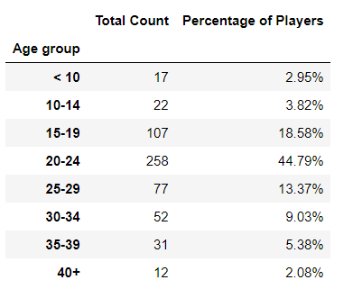
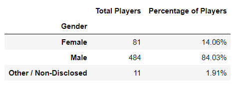
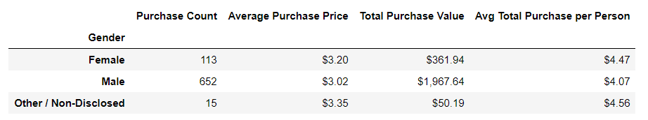
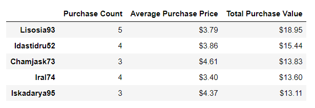
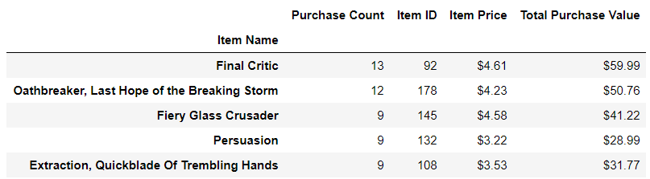
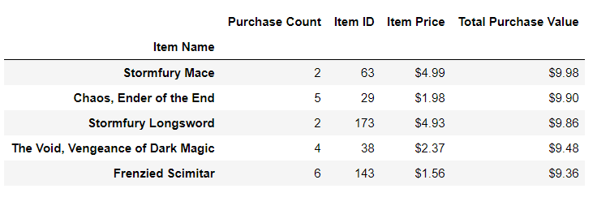

# Heros of Pymoli
Project Description

The task is to analyze the data generated for the new fantasy game, Heroes of Pymoli. The data was analyzed using pandas and jupyter notebook to breakdown he purchasing data into useful information to help identify target groups. The data was then trended for reporting.

Tools Required

Pandas
Jupyter Notebook
Python

Instructions

Count the total number of players.
Run basic calculations to obtain number of unique items, average price, etc. Create a summary data frame to hold the results
Calculate count and percentage of males, females, and non-disclosed players
Run basic calculations to obtain purchase count, avg. purchase price, avg. purchase total per person etc. by gender. Create a summary data frame to hold the results
Categorize the existing players using the age bins. Calculate the numbers and percentages by age group. Create a summary data frame to hold the results
Bin the purchase_data data frame by age. Run basic calculations to obtain purchase count, avg. purchase price, avg. purchase total per person etc. in the table below. Create a summary data frame to hold the results
Run basic calculations to obtain the results in the table below. Create a summary data frame to hold the results. Sort the total purchase value column in descending order
Retrieve the Item ID, Item Name, and Item Price columns. Group by Item ID and Item Name. Perform calculations to obtain purchase count, item price, and total purchase value. Create a summary data frame to hold the results. Sort the purchase count column in descending order.
Sort the above table by total purchase value in descending order.

Files

HeroesOfPymoli_working_final.ipynb – jupyter notebook containing code for analyzing data 

Results

Age Demographics

Purchasing Analysis (Age)

Gender Demographics

Purchasing Analysis (Gender)

Top Spenders

Most Popular Items

Most Profitable Items

